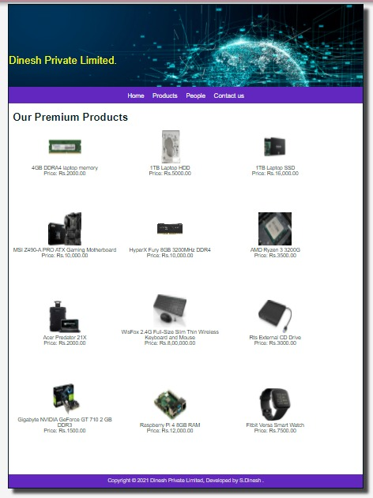
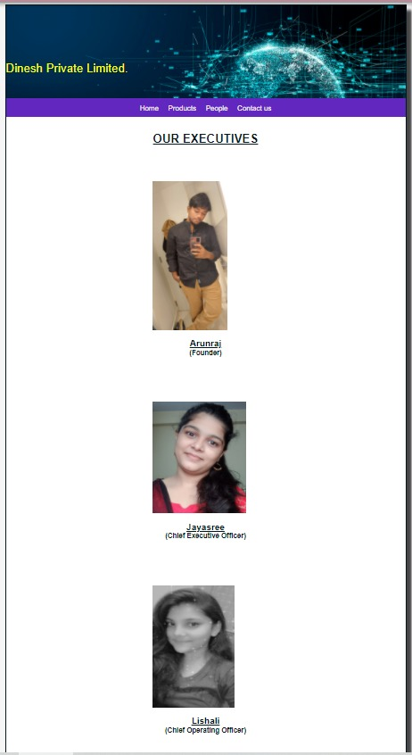
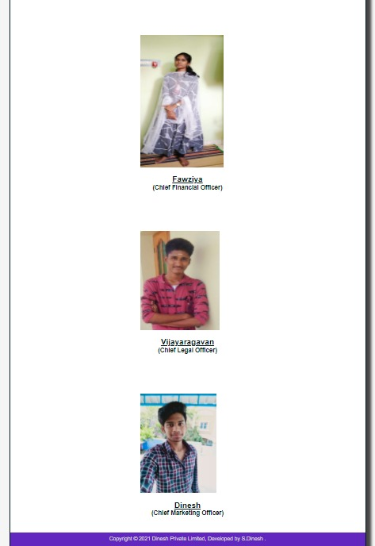
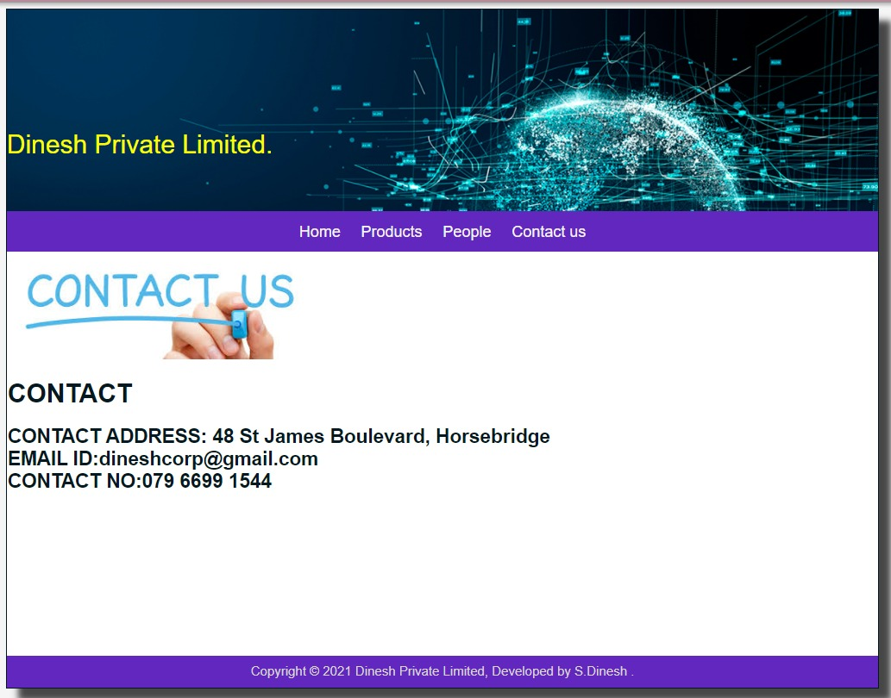
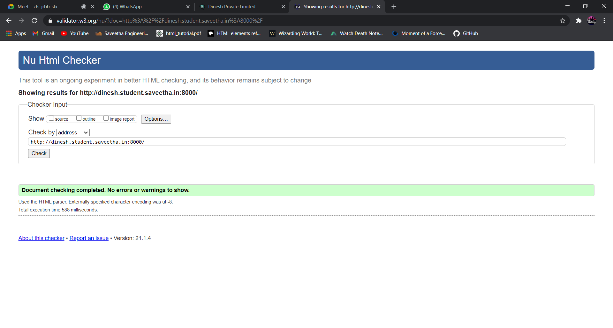
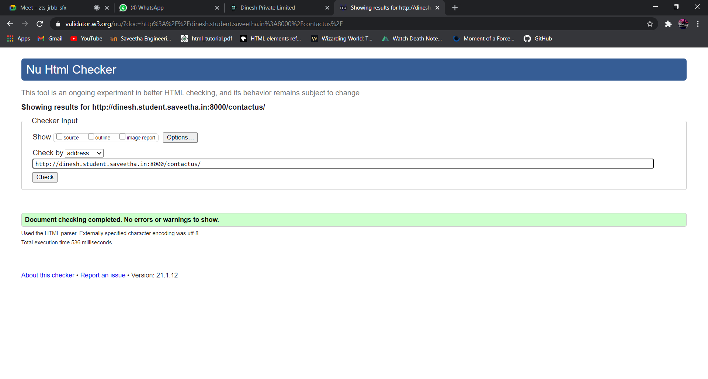
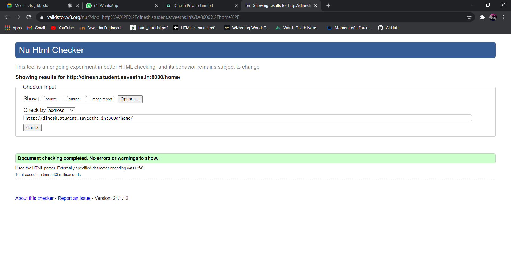

# Web Design for a Manufacturing Company
## AIM: 
To design a static website for a chip manufacturing company.

## DESIGN STEPS:
### Step 1: 
Requirement collection.
### Step 2:
Creating the layout using HTML and CSS.
### Step 3:
Updating the sample content.
### Step 4:
Choose the appropriate style and color scheme.
### Step 5:
Validate the layout in various browsers.
### Step 6:
Validate the HTML code.
### Step 6:
Publish the website in the given URL.

## PROGRAM:

### base.html
```

<!DOCTYPE html>
<html lang="en">

<head>
    <title>Dinesh Private Limited</title>
    <link rel="stylesheet" href="">
    <link rel = "icon" href ="" type = "image/x-icon"> 
              
</head>

<body>
    <div class="container">
    <div class="banner">
    Dinesh Private Limited.
    </div>
    <div class="menu">
        <div class="menuitem"><a href="/home">Home</a></div> 
        <div class="menuitem"><a href="/products">Products</a></div> 
        <div class="menuitem"><a href="/people">People</a></div>
        <div class="menuitem"><a href="/contactus">Contact us</a></div>
    </div><div class="content">
        
    
    </div>
    <div class="footer">
        Copyright © 2021 Dinesh Private Limited, Developed by S.Dinesh .
    </div>
    </div>
</body>

</html>
```

### home.html
```



    <div class="homecontent">    
   <h1><u>About Us</u></h1>
    
    <div class="contenttext">
    Dinesh Pvt Ltd, provides a broad range of semiconductor and infrastructure software applications that serve the data center, networking, software, broadband, wireless, and storage and industrial markets. Common applications for its products include: data center networking, home connectivity, broadband access, telecommunications equipment, smartphones, base stations, data center servers and storage, factory automation, power generation and alternative energy systems, displays, and mainframe operations and management, and application software development. Some of Silicon's core technologies and products include:
    <ul>
        <li>Memory Chips</li>
        <li>SATA HDD</li>
        <li>SATA SSD </li>
        <li>Broadband Modems</li>
        <li>Wifi Devices</li>
        <li>Switching Devices</li>
        <li>Optical Sensors</li>
    </ul> 
    </div>
    </div>

```
### products.html
```



    <div class="productcontent">    
    <h1>Our Premium Products</h1>
    <div class="productitems">
        <div class="productitem"> 
            <div class="itemimage">
            
            </div>
            <div class="itemname">4GB DDRA4 laptop memory</div>
            <div class="itemprice">Price: Rs.2000.00 </div>
        </div>
        <div class="productitem"> 
            <div class="itemimage">
            
            </div>
            <div class="itemname">1TB Laptop HDD</div>
            <div class="itemprice">Price: Rs.5000.00 </div>
        </div>
        <div class="productitem"> 
            <div class="itemimage">
            
            </div>
            <div class="itemname">1TB Laptop SSD</div>
            <div class="itemprice">Price: Rs.16,000.00 </div>
        </div>
        <div class="productitem"> 
            <div class="itemimage">
            
            </div>
            <div class="itemname">MSI Z490-A PRO ATX Gaming Motherboard</div>
            <div class="itemprice">Price: Rs.10,000.00 </div>
        </div>
        <div class="productitem"> 
            <div class="itemimage">
            
            </div>
            <div class="itemname"> HyperX Fury 8GB 3200MHz DDR4</div>
            <div class="itemprice">Price: Rs.10,000.00 </div>
        </div>
        <div class="productitem"> 
            <div class="itemimage">
            
            </div>
            <div class="itemname">AMD Ryzen 3 3200G</div>
            <div class="itemprice">Price: Rs.3500.00 </div>
        </div>
        <div class="productitem"> 
            <div class="itemimage">
            
            </div>
            <div class="itemname">Acer Predator 21X</div>
            <div class="itemprice">Price: Rs.2000.00 </div>
        </div>
        <div class="productitem"> 
            <div class="itemimage">
            
            </div>
            <div class="itemname">WisFox 2.4G Full-Size Slim Thin Wireless Keyboard and Mouse</div>
            <div class="itemprice">Price: Rs.8,00,000.00 </div>
        </div>
        <div class="productitem"> 
            <div class="itemimage">
            
            </div>
            <div class="itemname">Rts External CD Drive</div>
            <div class="itemprice">Price: Rs.3000.00 </div>
        </div>
        <div class="productitem"> 
            <div class="itemimage">
            
            </div>
            <div class="itemname">Gigabyte NVIDIA GeForce GT 710 2 GB DDR3</div>
            <div class="itemprice">Price: Rs.1500.00</div>
        </div>
        <div class="productitem"> 
            <div class="itemimage">
            
            </div>
            <div class="itemname">Raspberry Pi 4 8GB RAM</div>
            <div class="itemprice">Price: Rs.12,000.00 </div>
        </div>
        <div class="productitem"> 
            <div class="itemimage">
            
            </div>
            <div class="itemname">Fitbit Versa Smart Watch</div>
            <div class="itemprice">Price: Rs.7500.00 </div>
        </div>
    </div>
    </div>

```
### people.html
```



    <div class="peoplecontent">
        <h1>OUR EXECUTIVES</h1>
    </div>
    <div class="peoplelists">
        <div class="peoplelist">
            <div class="peopleimage">
                
            </div>
            <div class="peoplename"><h2>Arunraj</h2></div>
            <div class="peoplepost"><h3>(Founder)</h3></div>
        </div>
    
        
    </div>
    <div class="peoplelists">
        <div class="peoplelist">
            <div class="peopleimage">
                
            </div>
            <div class="peoplename"><h2>Jayasree</h2></div>
            <div class="peoplepost"><h3>(Chief Executive Officer)</h3></div>
        </div>
    
       
    </div>
    <div class="peoplelists">
        <div class="peoplelist">
            <div class="peopleimage">
                
            </div>
            <div class="peoplename"><h2>Lishali</h2></div>
            <div class="peoplepost"><h3>(Chief Operating Officer)</h3></div>
        </div>
    </div>
    
    <div class="peoplelists">
        <div class="peoplelist">
            <div class="peopleimage">
                
            </div>
            <div class="peoplename"><h2>Fawziya</h2></div>
            <div class="peoplepost"><h3>(Chief Financial Officer)</h3></div>
        </div>
    </div>
    
    <div class="peoplelists">
        <div class="peoplelist">
            <div class="peopleimage">
                
            </div>
            <div class="peoplename"><h2>Vijayaragavan</h2></div>
            <div class="peoplepost"><h3>(Chief Legal Officer)</h3></div>
        </div>
    </div>
    
    <div class="peoplelists">
        <div class="peoplelist">
            <div class="peopleimage">
                
            </div>
            <div class="peoplename"><h2>Dinesh</h2></div>
            <div class="peoplepost"><h3>(Chief Marketing Officer)</h3></div>
        </div>
    </div>

```
### contactus.html
```



 <div>
    
</div>
    <h1 class="contactcenter">
        CONTACT
    </h1>
    <h2 class="contactcenter">
    CONTACT ADDRESS: 48 St James Boulevard, Horsebridge<br>
      
    EMAIL ID:dineshcorp@gmail.com<br>
            
       CONTACT NO:079 6699 1544
    </h2>



```
## OUTPUT:










## CODE VALIDATION REPORT:






## RESULT:
Thus a website is designed for the chip manufacturing company and is hosted in the URL http://dinesh.student.saveetha.in:8000/. HTML code is validated.